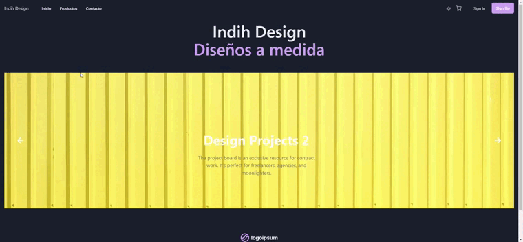

#  Indih Design 
### _Diseños a medida_


 
 


## 🌏 Sitio Web     
### 👉 [indih-design](https://indih-design-gianni.vercel.app/)



## 🚢 Navegación del sitio
- Home : Ingresando a la ruta ``` "/" o /home ``` se llega a un template (``` En desarrollo ```) de lo que va a ser el home de la pagina 
- Productos : Filtros por cada categoria de productos y por su totalidad accediendo desde el menu o a las rutas ```/productos y /productos/:categoria``` .
    - Detalle del producto : Una vez seleccionado un producto podras seleccionar una cantidad determinada y agregarlos a tu carrito de compra
    - Stock : No podras incluir cantidades que desborden el limite de stock para cada producto, deshabilitando el boton de agregar al carrito en caso de ya estar en 0 , o con un alert dialog en caso de que tu agregado este superando el limite actual.
    - Galeria de productos : ``` En desarrollo ```.
    - Disponibilidad de colores : ``` En desarrollo ```.
- Carrito de compra : El carrito de compra funciona como un contexto general de la aplicacion.
    - CartDrawer : Al momento de agregar un producto a nuestro carrito, estando en cualquier ruta de nuestra aplicacion, podremos entrar al cart drawer clickeando en el carrito del menu de navegacion, este nos mostrará toda la informacion relacionada a la compra actual.
    - Carrito : Al finalizar la compra en el drawer, la aplicacion,  nos dirigirá hacia la ruta ```/cart``` para poder tener la misma informacion que veiamos en el drawer y a esto sumarle el formulario de compra para poder finalizarla.
    - Finalizar compra : Una vez que completamos los datos y apretamos el boton #Pagar nos dirige hacia una pagina de exito, y nos informara el numero de orden generado y la posibilidad de ver el detalle de esa orden.
    - Orden : Resumen de la compra realizada por el cliente. 
    - Medios de pago : ``` En desarrollo ```.
    - Validacion de direcciones : ``` En desarrollo ```.
- Color Mode : En el menu de navegacion existe un boton que permite hacer el switch entre el Light y Dark Mode
- Inicio de session : ``` En desarrollo ```.
- Registro de usuarios : ``` En desarrollo ```.
- CRUD de productos : ``` En desarrollo ```.


## 🔮 Tech

En el desarrollo de este Ecommerce se usaron las siguientes tecnologias :

| Tech        | Descrip           | Version  | link  |
| ------------- |:-------------:| -----:| :-----:|
| React js      | FrontEnd core lenguaje | **17.0.2** | https://reactjs.org/ |
| Firebase     | Backend - DB     |  **9.8.1** | https://firebase.google.com/ |
| Vite     | Build tool      |  **2.9.0** | https://vitejs.dev/ |
| React-Router-dom     | Router library      |  **17.0.2** |https://reactrouter.com/ |
| Chakra UI     | UI library      |  **1.8.8** |https://v1.chakra-ui.com/ |
| Framer-motion     | Motion library for React    |  **6.3.10** |https://www.framer.com/motion/|
| React-Hook-form     | forms data manipulation      |  **7.31.3** |https://react-hook-form.com/ |
| React-icons     | Icons library     |  **4.3.1** |https://react-icons.github.io/react-icons/|
| React-slick     | Small slider effects library      |  **0.29.0** |https://react-slick.neostack.com/ |
